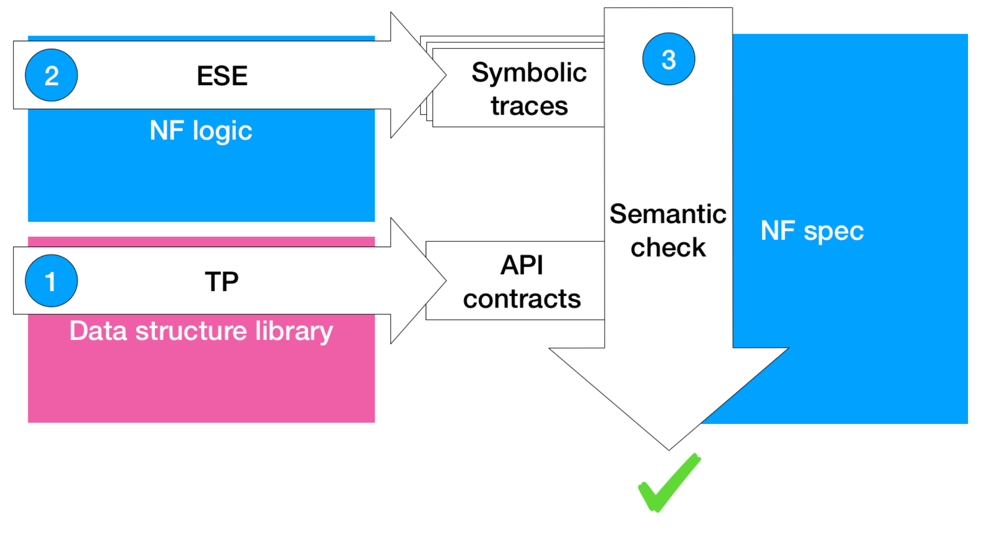
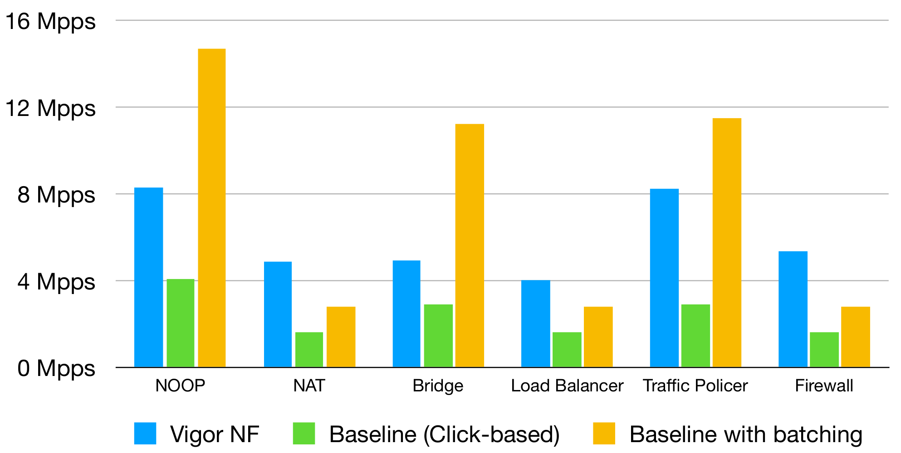
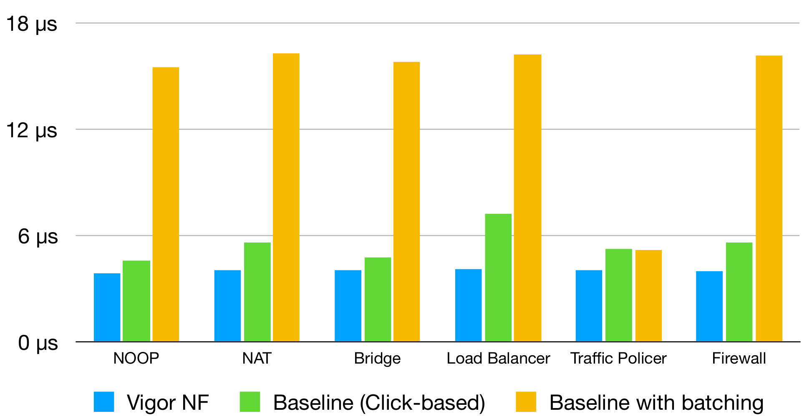

{::options parse_block_html="true" /}

{: width="100%"}

{: #overview .text-center}
## Verification of Software <abbr title="Network Functions">NFs</abbr> with   No Verification Expertise

{: .lead}
_**Vigor**_ is a software stack and toolchain for building and running software network middleboxes that are guaranteed to be *correct*,
while preserving *competitive performance* and developer *productivity*.

{: .text-justify}
Developers write the core of the middlebox — the network function (NF) — in C,
on top of a standard packet-processing framework ([DPDK](https://www.dpdk.org)),
putting persistent state in data structures from Vigor’s library (libVig);
the Vigor toolchain then automatically verifies that the resulting software stack correctly implements a specification,
which is written in Python. 

{::options parse_block_html="true" /}

{: .text-center}
#### Push-button

{: .text-justify}
Network function developers need no verification expertise,
and the verification process does not require their assistance.

{: .text-center}
#### Pay-as-you-go

{: .text-justify}
Verification can be done in a pay-as-you-go manner,
i.e., instead of investing upfront a lot of time in writing and verifying a complete specification,
one can specify one-off properties in a few lines of Python and verify them without concern for the rest.

{: .text-center}
#### Full-stack

{: .text-justify}
The entire software stack (framework, driver, OS) is verified, down to the hardware.

* * *

{: .text-center}
#### Case Studies

{: .text-justify}
We developed five representative NFs:

* a NAT,
* a [Maglev](https://ai.google/research/pubs/pub44824/) load balancer,
* a MAC-learning bridge,
* a stateful firewall, and
* a traffic policer,

and verified with Vigor that they satisfy standards-derived specifications, are memory-safe, and do not crash or hang.

* * *

{: .text-center}
#### Runtime Performance 
{::options parse_block_html="true" /}

{: .text-justify}
We measure runtime performance on Intel Xeon #5-2667 machines at 90% occupancy of the NF's main data structure and compare it with performance of [Click](https://github.com/tbarbette/fastclick) modular router based on DPDK kernel bypass framework.
Only for the policer we couldn't find off-the-shelf Click element so we use [moonpol](https://github.com/erkinkirdan/moonpol/) instead.

Vigor does not support batching, so all Vigor NFs process 1 packet at a time. However we measure performance of the default batching mode for the baseline NFs as well as their non-batching versions.

All NFs run on a single core.

##### Throughput

{: width="100%"}

{: .text-justify}
Vigor NFs have competitive throughput with the non-batching baselines.
The batching benefit shows here as about 2x better throughput on some NFs.

We believe that the Vigor NFs sustain sufficient throughput for most non-performance critical applications.

{: .text-justify}

##### Latency

{: .text-justify}
Vigor NFs have minimal average latency across all experiments, likely because of their monolithic structure.
The monolithic structure poses no issue, since we verify correctness of the whole software stack.

Note, how batching always degrades the average latency due to the necessary delay of accumulating a batch.

{: width="100%"}

* * *

{: #publications .text-center}
### Publications

**[Verifying Software Network Functions with No Verification Expertise](vigor-paper.pdf)**.
_Arseniy Zaostrovnykh, Solal Pirelli, Rishabh Iyer, Matteo Rizzo, Luis Pedrosa, Katerina Argyraki, George Candea_.
ACM Symposium on Operating Systems Principles (**[SOSP](https://sosp19.rcs.uwaterloo.ca/)**), Ontario, Canada, Oct 2019

**[A Formally Verified NAT Stack](formally-verified-nat-stack.pdf)**.
_Solal Pirelli, Arseniy Zaostrovnykh, George Candea._
ACM SIGCOMM Kernel Bypassing Networks workshop (**[KBNets](https://conferences.sigcomm.org/sigcomm/2018/workshop-kbnets.html)**), Budapest, Hungary, August 2018 (_Best Paper Award_{:.underline}) ([talk video](https://youtu.be/esfwD46f2ZI))

**[A Formally Verified NAT](vignat-paper.pdf)**.
_Arseniy Zaostrovnykh, Solal Pirelli, Luis Pedrosa, Katerina Argyraki, George Candea._
ACM SIGCOMM Conference (**[SIGCOMM](http://conferences.sigcomm.org/sigcomm/2017/)**), Los Angeles, CA, August 2017

* * *

{: #thecode .text-center}
### Getting the code

Vigor's code and Vigor-based NFs are available [on GitHub](https://github.com/vigor-nf/vigor).

* * *

{: #contributing .text-center}
### How Can I Contribute?

There are several ways you can help the project:

* Use Vigor to develop and verify another network function
* Extend libVig with a new efficient and verified component, useful for network functions, such as a regular expression matcher or cryptographic primitive.

* * *

{: #related .text-center}
### Related Projects

Vigor builds on top of [KLEE](https://klee.github.io) symbolic execution engine and [VeriFast](https://github.com/verifast/verifast) theorem prover for C.
Vigor has inspired the [Bolt](https://bolt-perf-contracts.github.io/) tool for reasoning about performance contracts.

* * *
  
{: #team .text-center}
### Team 

Arseniy Zaostrovnykh, Solal Pirelli, Rishabh Iyer, Matteo Rizzo, Luis Pedrosa, Katerina Argyraki, George Candea
